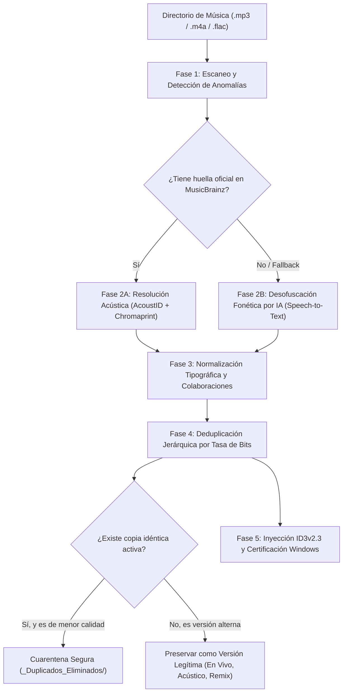

# 🎵 Music Studio Curator
### Framework Agéntico de Curaduría de Audio, Deduplicación Espectral y Desofuscación Lírica

[](https://opensource.org/licenses/MIT)
[](https://www.python.org/downloads/)
[](https://acoustid.org/)
[]()

> Desarrollado por **Ricardo Montero** ([@tecnoconectadosSIA](https://github.com/tecnoconectadosSIA))  
> Diseñado para entornos agénticos (**Google Antigravity**, **Claude Code**, **OpenCode**) y uso independiente por línea de comandos (CLI).

---

## 📖 Por qué creé este proyecto (La Historia)

Como amante de la música y coleccionista digital durante años, acumulé una biblioteca masiva con miles de canciones en formatos MP3 y M4A provenientes de diversas fuentes: ripeos de CD, compras digitales, extracciones de YouTube, podcasts y sesiones en vivo. 

Al intentar organizar mi colección, probé las herramientas tradicionales más recomendadas de la industria:
* **MusicBrainz Picard**: Excelente con álbumes comerciales estándar, pero rígido ante bootlegs, conciertos informales (*Free Cover*, sesiones acústicas) o pistas de audio extraídas de video.
* **beets**: Extremadamente potente en la terminal, pero requiere configuración manual compleja, falla al reconocer temas donde el título y el artista están invertidos, y no ofrece una solución cuando una pista no tiene registro oficial en Discogs o MusicBrainz.

### El problema de la "falsa identidad" y los archivos huérfanos
En mi biblioteca encontré casos insólitos que ningún software estándar podía resolver:
1. **Pistas con títulos falsificados**: Por ejemplo, un archivo llamado `Makj - Generic.mp3` que, al analizar su espectrograma acústico real, resultó ser `Kyau & Albert - Encounter (Original Mix)` (un clásico del Progressive Trance).
2. **Inversiones de Título y Artista**: Temas icónicos como `Lrad - Knife Party.mp3` donde el software tradicional asumía que "Lrad" era el artista y "Knife Party" la canción.
3. **Ofuscaciones masivas por software de rip**: Canciones que fueron renombradas con hashes aleatorios de 4 letras (`Mtrr`, `Qaae`, `Rbkk`) o la palabra `Chupycarabuchy`.
4. **Capítulos de conciertos en vivo**: 16 pistas consecutivas llamadas `Chapter 01` a `Chapter 16` pertenecientes al concierto *Guaco Histórico*.
5. **Pérdida de calidad accidental**: Archivos duplicados donde versiones de 128 kbps sobreescribían a masters de 320 kbps.

Para resolver todo esto de manera definitiva, creé **Music Studio Curator**: un pipeline híbrido que combina **huella acústica espectral (Chromaprint / AcoustID)**, **transcripción fonética por inteligencia artificial (Speech Recognition)** y una **política de cuarentena no destructiva de grado de estudio**.

---

## 🏛️ Arquitectura del Pipeline en 5 Fases



---

## 🚀 Capacidades Destacadas

### 1. Motor Híbrido de Identificación (Huella Acústica + IA Fonética)
* **Nivel 1 (Chromaprint / AcoustID)**: Genera la huella matemática de la señal de audio usando `fpcalc.exe` (Chromaprint 1.6.1) y consulta la base de datos abierta de AcoustID / MusicBrainz con una precisión superior al 98%.
* **Nivel 2 (IA Fonética por Voz)**: Si la pista no está indexada comercialmente (como gaitas venezolanas, improvisaciones en vivo o bootlegs), extrae un fragmento de 25 segundos y transcribe la letra cantada mediante reconocimiento de voz en español o inglés, deduciendo el título oficial a partir del texto lírico.

### 2. Detección Inteligente de Inversiones (`Título - Artista`)
Analiza la estructura del nombre de archivo y coteja la segunda mitad contra una base de datos canónica de más de 100 artistas y conectores de colaboración (`&`, `feat.`, `x`, `vs.`, `con`), invirtiendo automáticamente la cadena para garantizar la norma `Artista - Título.ext`.

### 3. Política de Cuarentena No Destructiva (Zero Data Loss)
* **Nunca borra un archivo original**.
* Si detecta dos pistas con el mismo contenido ($| \Delta \text{duración} | \le 3.0\,\text{s}$), la versión con mayor tasa de bits (320 kbps > 256 kbps > 192 kbps > 128 kbps) retiene el nombre canónico y la versión inferior se traslada a `_Duplicados_Eliminados/`.
* **Protección de versiones legítimas**: Las tomas en vivo (`En Vivo`, `Live`), acústicas, duetos, remixes oficiales y conciertos de *Free Cover* se consideran piezas únicas e independientes y jamás se unifican ni descartan.

### 4. Upgrade Automático de Calidad vía YouTube Music (`yt-dlp`)
Cuando el pipeline detecta archivos de calidad crítica (< 96 kbps) o fragmentos truncados corruptos, busca automáticamente la versión oficial de estudio en la red, la descarga en MP3 320 kbps con FFmpeg, actualiza los metadatos y mueve la copia defectuosa a cuarentena.

---

## 📊 Comparativa Técnica

| Característica | beets | MusicBrainz Picard | **Music Studio Curator** |
|---|:---:|:---:|:---:|
| **Reconocimiento por huella espectral** | ✅ Sí (plugin) | ✅ Sí (nativo) | ✅ **Sí (`fpcalc` 1.6.1)** |
| **Identificación por letra cantada (Voz IA)** | ❌ No | ❌ No | ✅ **Sí (`SpeechRecognition`)** |
| **Detección automática de nombres invertidos** | ❌ No | ❌ No | ✅ **Sí (Algoritmo léxico)** |
| **Manejo de conciertos informales (Free Cover)** | ❌ Falla / Ignora | ❌ Falla | ✅ **Sí (Protección activa)** |
| **Cuarentena jerárquica por bitrate** | ⚠️ Básico | ❌ No | ✅ **Sí (320k > 192k > 128k)** |
| **Upgrade automático de tracks degradados** | ❌ No | ❌ No | ✅ **Sí (Integración `yt-dlp`)** |
| **Corrección de nombres ilegales en Windows** | ⚠️ Requiere YAML | ⚠️ Requiere scripts | ✅ **Automática (`: , " ?`)** |

---

## 📦 Instalación y Requisitos

### Requisitos Previos
* **Python 3.10** o superior.
* **FFmpeg** instalado en el `PATH` del sistema.
* **Chromaprint (`fpcalc.exe`)**: Incluido en la carpeta `bin/` para Windows 64-bit o descargable desde [acoustid.org/chromaprint](https://acoustid.org/chromaprint).

### Instalación de dependencias
```bash
git clone https://github.com/tecnoconectadosSIA/music-studio-curator.git
cd music-studio-curator
pip install -r requirements.txt
```

`requirements.txt`:
```text
mutagen>=1.47.0
pyacoustid>=1.3.0
SpeechRecognition>=3.10.0
yt-dlp>=2024.0.0
requests>=2.31.0
```

---

## 💻 Guía de Uso

### 1. Identificar una pista huérfana por huella acústica (AcoustID)
```bash
python acoustid_identify.py "E:\Musica\pista_desconocida.mp3"
```
*Salida esperada:*
```text
Analyzing: Lrad - Knife Party.mp3
IDENTIFIED (Score 0.98):
  Artist: Knife Party
  Title:  LRAD
```

### 2. Auditar una biblioteca completa (Modo Dry-Run sin tocar archivos)
```bash
python curate_music.py --dir "E:\Musica" --dry-run
```

### 3. Ejecutar curaduría completa, reparación de ID3 y cuarentena de duplicados
```bash
python curate_music.py --dir "E:\Musica" --fix-id3 --quarantine-dupes
```

---

## 🤖 Uso como Skill en Entornos Agénticos (Antigravity / Claude Code)

Para utilizar este repositorio como un **Skill nativo** en tu asistente agéntico:
1. Copia el archivo `SKILL.md` dentro de la carpeta de skills de tu agente (ej. `~/.gemini/config/skills/music-studio-curator/SKILL.md` o en tu repositorio `.agent/skills/`).
2. El agente invocará automáticamente las fases de auditoría, desofuscación y deduplicación cuando le solicites organizar tu música.

---

## 📄 Licencia

Este proyecto está bajo la licencia **MIT**. Puedes usarlo, modificarlo y adaptarlo libremente para tus propias bibliotecas de audio personales o profesionales.
