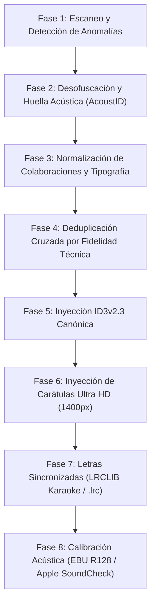

# 🎵 Music Studio Curator (Skill de Curaduría de Audio Profesional)

Este skill proporciona un pipeline industrial de grado de estudio para la auditoría, desofuscación, normalización de metadatos ID3, enriquecimiento visual y lírico, calibración acústica no destructiva y deduplicación certificada de bibliotecas musicales masivas.

---

## 🏛️ Principios Fundamentales y Reglas de Oro

1. **Integridad de Contenido (No Destructivo)**:
   - **NUNCA borrar pistas originales**. Todo duplicado o archivo degradado debe ser trasladado a `_Duplicados_Eliminados/` con bitácora auditable.
   - Las calibraciones de volumen **NUNCA recomprimen el audio**; se inyectan como metadatos de ganancia (ReplayGain / SoundCheck).

2. **Diferenciación de Versiones Legítimas vs. Duplicados Técnicos**:
   - **Son versiones independientes y legítimas**: Pistas en vivo (`En Vivo`, `Live`), acústicas, duetos, remixes oficiales, mini-conciertos (`Free Cover`), sesiones de estudio alternativas (`MTV Unplugged`, `Corona Music Sessions`), tomas instrumentales y versiones extendidas/de video con intros narrativos.
   - **Criterio de Duplicado Técnico Real**: Mismo contenido musical donde $|\text{duración}_A - \text{duración}_B| \le 3.0\,\text{s}$ y ambas representan la misma toma sonora.
   - **Resolución de Duplicados**: El archivo con mayor bitrate o formato superior (.flac > .m4a > .mp3 320k > 192k > 128k) retiene el nombre canónico y las etiquetas completas; la copia inferior se archiva en cuarentena.

3. **Sintaxis de Archivo y Compatibilidad con Windows**:
   - Estructura universal obligatoria: `Artista - Título.ext`.
   - Prohibición absoluta de caracteres ilegales en Windows (`:`, `*`, `?`, `"`, `<`, `>`, `|`, `/`, `\`). Los medleys o subtítulos deben usar comas o guiones (ej. `Guaco - Medley - Noche Sensacional, El Billetero (En Vivo).mp3`).
   - Detección y corrección obligatoria de paréntesis o corchetes no balanceados o truncados (`(` sin `)`, `]` sin `[`).

---

## 🛠️ Pipeline Industrial de Curaduría (8 Fases)

```mermaid
flowchart TD
    A["Fase 1: Escaneo y Detección de Anomalías"] --> B["Fase 2: Desofuscación y Huella Acústica (AcoustID)"]
    B --> C["Fase 3: Normalización de Colaboraciones y Tipografía"]
    C --> D["Fase 4: Deduplicación Cruzada por Fidelidad Técnica"]
    D --> E["Fase 5: Inyección ID3v2.3 Canónica"]
    E --> F["Fase 6: Inyección de Carátulas Ultra HD (1400px)"]
    F --> G["Fase 7: Letras Sincronizadas (LRCLIB Karaoke / .lrc)"]
    G --> H["Fase 8: Calibración Acústica (EBU R128 / Apple SoundCheck)"]
```

### Fase 1: Escaneo de Patrones Parásitos y Estructuras Invertidas
- **Detección de Títulos Invertidos**: Archivos donde el artista aparece en la segunda mitad (`Título - Artista`).
- **Eliminación de Prefijos de Bandas Sonoras**: Desmontar etiquetas genéricas como `Various Artists - Artista – Título` y restaurar la autoría original.
- **Purgado de Ruido Residual**: Remover `[OFFICIAL VIDEO]`, `(Video Oficial)`, `(Letra / Lyrics)`, `(Prod. By ...)`, `(Audio Original)`, canales de YouTube, nombres de uploaders (`by Gabrielpauta`, `Lanzamientosmp3`) y años residuales en sufijos (`(reggaeton 2016)`).

### Fase 2: Desofuscación Fonética y Huella Acústica
- **Prohibición de Nombres Genéricos**: Prohibir nombres como `Track X`, `Pista X`, `Video Oficial`, `Salsa Baúl` o códigos alfanuméricos (`Mtrr`, hashes, códigos de 4 letras de iPod).
- **Huella Acústica (AcoustID / Chromaprint)**: Cálculo de huella con `fpcalc.exe` y consulta a la API de AcoustID para recuperar títulos y artistas auténticos con confianza $\ge 90\%$.

### Fase 3: Estandarización de Colaboraciones y Tipografía
- Unificar todas las fórmulas de colaboración al estándar canónico:
  - `con X`, `ft. X`, `ft X`, `feat X`, `, X`, `x X`, `a Dúo con X` ➡️ `feat. X` o `& X`.
- Formateo editorial con tildes y diéresis correctas (ej. `Mägo de Oz`, `OneRepublic`, `Qué Quieres de Mí`, `Abrázame`, `Corazón Abierto`).

### Fase 4: Deduplicación Cruzada
- Agrupar por clave canónica normalizada (NFKD: minúsculas, sin tildes, sin signos de puntuación).
- Comparar duraciones y tasas de bits:
  * Si $\Delta \text{duración} \le 3.0\,\text{s}$: Conservar el archivo de máxima tasa de bits y trasladar el inferior a `_Duplicados_Eliminados/`.
  * Si $\Delta \text{duración} > 5.0\,\text{s}$: Mantener ambas versiones, asignando sufijos descriptivos claros (`(Versión Radio)`, `(Versión Extendida)`, `(En Vivo)`).

### Fase 5: Inyección de Metadatos ID3v2.3
- Inyectar etiquetas limpias y exactas compatibles universalmente:
  * `TPE1` (Artista principal y colaboradores)
  * `TIT2` (Título limpio sin parásitos)
  * `TALB` (Álbum oficial con tildes)
  * `TRCK` (Número de pista en álbumes estructurados)

### Fase 6: Inyección de Carátulas Ultra HD (Artwork Embedder)
- Inspección del frame `APIC` (MP3) o átomo `covr` (M4A).
- Si no existe carátula o tiene baja resolución ($< 500\text{ px}$):
  1. Consultar **iTunes Search API** (`artworkUrl100` reescalado a `1400x1400bb.jpg`).
  2. Fallback con **Deezer API** (`cover_xl` a $1000\times1000\text{ px}$).
  3. Incrustar en el archivo directamente sin recomprimir el stream de audio.
  4. Cachear por artista/álbum para optimizar ancho de banda.

### Fase 7: Letras Sincronizadas (Synced Lyrics / Karaoke)
- Consulta a la API abierta **LRCLIB** (`https://lrclib.net/api/get` y `/search`).
- Si existen letras sincronizadas:
  1. Guardar archivo `.lrc` con marcas de tiempo en el mismo directorio: `Artista - Canción.lrc`.
  2. Incrustar el frame `USLT` (texto completo) en la etiqueta ID3 para compatibilidad sin conexión y reproductores de autos o iPod.

### Fase 8: Calibración Acústica No Destructiva (Loudness Normalization)
- Inyección de metadatos de ganancia bajo especificación **EBU R128 (-14 LUFS standard)**:
  * `TXXX:REPLAYGAIN_TRACK_GAIN`
  * `TXXX:REPLAYGAIN_TRACK_PEAK`
  * `COMM:iTunNORM` (Apple Sound Check para iTunes, iPod e iOS)
- Los reproductores ecualizan el volumen automáticamente en tiempo real evitando distorsión armónica y saltos abruptos entre pistas de diferentes épocas.
